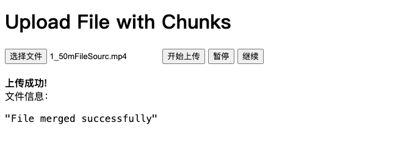
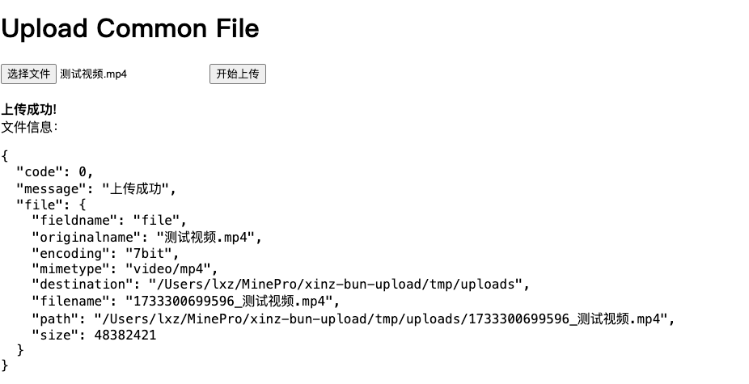
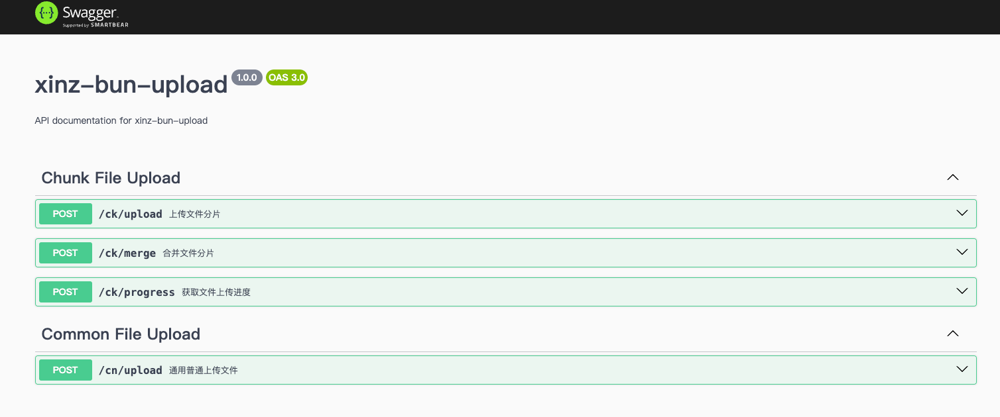

# xinz-bun-upload

通用文件上传和大文件分片上传（断点/断网续传）的后台服务（bun + express）。

## 前言

本项目实现了通用文件上传和大文件分片上传功能，支持断点续传、断网续传等特性。通过简单的接口，用户可以上传小文件，也可以对大文件进行分片上传，确保在断网或中途停止的情况下，上传任务可以从中断处继续进行。该项目适用于需要文件上传功能的各种应用场景。

项目源码地址(github)：
[https://github.com/1999-xinz/xinz-bun-upload.git](https://github.com/1999-xinz/xinz-bun-upload.git)

ps: 有帮助的话，可以给个stars，谢谢

## 项目功能

* 支持普通文件上传。
* 支持大文件分片上传，支持断点/断网续传。
* 支持swagger文档查看相关接口（共4个）。
* 提供前端页面进行接口测试。
* 本地简单模拟数据库的实现，方便学习重心放在上传的服务上。

## 如何启动

**1-安装依赖（如果没有bun的请先安装bun）：**

```bash
bun install
```

**2-运行项目：**

```bash
bun run src/app.ts 或 bun run start
```

## 项目目录说明

```bash
├── pages/                   # 前端上传测试页面
├── server/                  # 后端服务项目目录
│   ├── routes/              # 路由配置文件，定义上传接口
│   ├── swagger/             # swagger基础配置文件目录
│   ├── utils/              # 工具函数（主要编写了模拟数据库crud操作）
│   └── app.ts               # 应用主入口文件，配置和启动 Express、swagger 服务，托管前端页面服务等
├── tmp/
│   ├── db/                  # 模拟数据库，把预校验分片的分片索要进行文本长期存储，用于断点续传
│   └── uploads              # 存放上传的文件（可配置到其他位置）
├── package.json             # 项目依赖和脚本配置
├── bun.lockb                # Bun 的锁文件，确保项目依赖一致
└── README.md                # 项目说明文档
```

建议先从app.ts为入口，去查看相关接口文件、配置文件的代码。

在启动项目后，可以通过访问下面地址来进行接口测试，静态页面用express进行了托管（server/app.ts中）。

- 通用文件上传：http://127.0.0.1:3000/www/commonPage.html
- 分片文件上传：http://127.0.0.1:3000/www/chunkPage.html

上传的文件会存放到tmp/uploads/目录下面，包括分片文件也是在这下面，分片文件会在合并后删除。

## 项目测试效果和接口文档

**1-上传中的效果：**


**2-上传成功的效果：**

1、分片上传：



2、通用上传：



**3-接口文档：**


